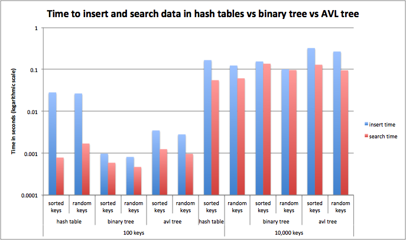

# Building trees to store random and sorted data
Homework 9: Trees

This repository contains modules to build a binary tree, and AVL tree, and
a hash table to store key, value pairs. The script insert_key_value_pairs.py
builds the desired data structure and benchmarks the time it takes to insert
all key, value pairs and then search for all keys.

## How to use

Data structures are built using the script insert_key_value_pairs.py, which
calls the modules binary_tree.py, avl_tree.py, and hash-tables-alisoncleonard.
The main script requires 2 input arguments:

--datastructure: the datastructure to build storing desired key, value
pairs. Choose from 'hash', 'binary_tree', or 'avl_tree'.

--dataset: a tab-separated txt file containing lines of key, value
pairs to store

--number_keys: the number of keys from dataset to read in

Example execution:
```
$ python insert_key_value_pairs.py --datastructure 'binary_tree' --dataset 'tabsep_testdata.txt'
```

## How to install

- wget https://repo.anaconda.com/miniconda/Miniconda3-latest-Linux-x86_64.sh
- bash Miniconda3-latest-Linux-x86_64.sh -b
- . /home/travis/miniconda3/etc/profile.d/conda.sh
- conda update --yes conda
- conda config --add channels r
- conda create --yes -n test
- conda activate test
- conda install --yes python=3.6
- conda install -y pycodestyle
- git submodule update --init

## Summary of benchmarking results between data structures



This script timed how long it took to insert data and then search for it in a
hash table, a binary tree, and an AVL tree. Hash tables were particularly slow
to insert data compared to either tree over a small number of keys, but as
trees became slower as the number of keys increased they became comparable to
trees. There is likely something wrong with my AVL tree rebalancing function
because my implementation is not faster than binary trees. 
